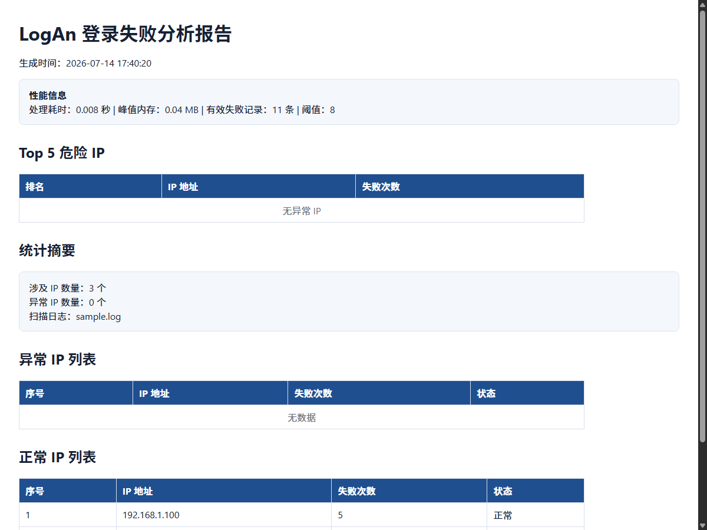

# LogAn

[](https://www.python.org/)
[](LICENSE)
[](.github/workflows/ci.yml)
[](#测试)

LogAn 是一个轻量级 SSH 登录失败日志分析工具，用于从服务器日志中统计失败登录来源 IP，识别疑似暴力破解行为，并生成 HTML/JSON 报告。

## 核心功能

- 自动解析 SSH 登录日志，提取失败登录记录
- 统计每个 IP 的失败次数，并按阈值标记异常 IP
- 生成 Top 5 危险 IP 排行
- 输出可视化 HTML 报告和结构化 JSON 报告
- 使用生成器链流式处理大文件，减少内存占用
- 支持 YAML/JSON 配置文件
- 支持白名单 IP 和自定义关键字
- 使用 pytest 编写单元测试，并支持覆盖率统计

## 报告预览



## 安装

从源码安装：

```bash
git clone https://github.com/yourname/logan-analyzer.git
cd logan-analyzer
pip install .
```

开发模式安装：

```bash
pip install -e ".[dev]"
```

## 使用

分析根目录示例日志：

```bash
logan sample.log
```

同时生成 HTML 和 JSON：

```bash
logan sample.log -f both
```

指定异常阈值和输出文件：

```bash
logan sample.log -t 10 -f both -o reports/security_report.html
```

使用配置文件：

```bash
logan sample.log -c config.yaml
```

查看版本：

```bash
logan --version
```

## 配置文件

`config.yaml` 示例：

```yaml
threshold: 8
format: both
output_dir: ./reports
base_name: daily_report
encoding: utf-8
quiet: false
log_level: INFO
log_file: ./logs/logan.log

whitelist:
  - 192.168.1.10
  - 10.0.0.1

keywords:
  - "Failed password"
  - "authentication failure"
  - "Invalid user"
```

## 测试

运行详细测试：

```bash
pytest -v
```

运行覆盖率测试：

```bash
pytest --cov=logan --cov-report=term-missing
```

生成 HTML 覆盖率报告：

```bash
pytest --cov=logan --cov-report=html
```

## 项目结构

```text
logan-analyzer/
├── 09.html
├── config.yaml
├── LICENSE
├── pyproject.toml
├── README.md
├── requirements.txt
├── sample.log
├── docs/
│   └── report_preview.png
├── src/
│   └── logan/
│       ├── __init__.py
│       ├── analyzer.py
│       └── cli.py
└── test/
    ├── __init__.py
    ├── test_analyzer.py
    └── test_cli.py
```

## GitHub 发布检查清单

- `README.md` 已编写
- `LICENSE` 已添加
- `.gitignore` 已配置
- `pyproject.toml` 已配置
- `pytest -v` 测试通过
- `pip install .` 安装成功
- `logan sample.log` 命令运行成功
- 报告截图已放入 `docs/report_preview.png`

## 常用命令

```bash
pip install .
pytest -v
logan sample.log
pip uninstall logan-analyzer
```

## License

MIT
